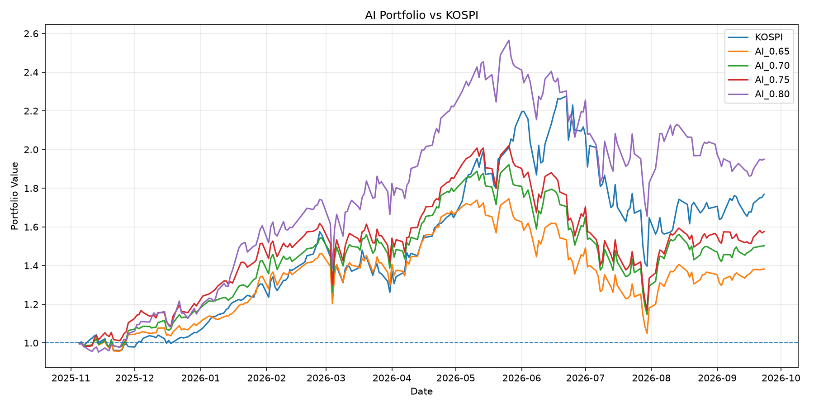
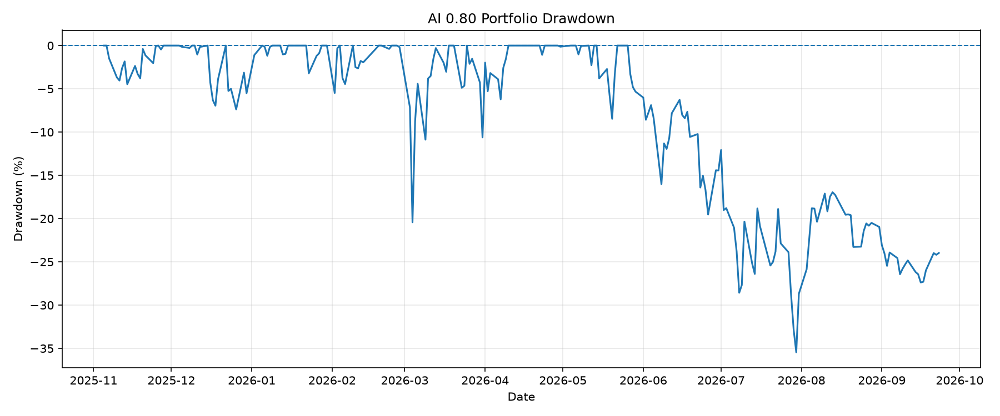
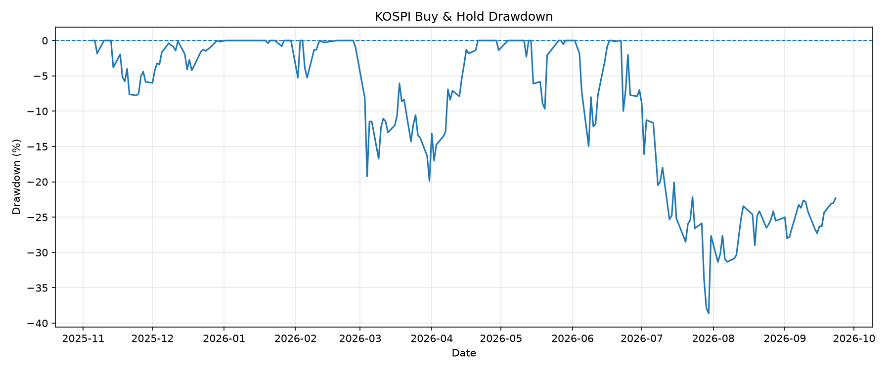

# Stock Analysis Web

기술적 지표와 머신러닝을 활용하여 **향후 5거래일 내 주가 상승 가능성을 예측하고, 예측 결과를 기반으로 포트폴리오 투자 전략을 백테스트한 프로젝트**입니다.

## 1. 프로젝트 소개

주가 데이터를 기반으로 기술적 지표를 생성하고 Random Forest 분류 모델을 활용하여 향후 5거래일 내 현재가 대비 **10% 이상 상승할 가능성**을 예측했습니다.

단순히 분류 성능만 비교하는 것이 아니라 예측 확률의 Threshold를 변화시키고, 실제 투자 상황을 가정한 포트폴리오 백테스트를 수행하여 전략의 투자 성과를 비교했습니다.

또한 추가 Feature를 적용한 V2 모델, Feature Ablation, Incremental Feature 실험과 Walk-forward Validation을 통해 Feature의 효과와 모델의 안정성을 확인했습니다.

---

## 2. 프로젝트 목표

* 주가 데이터를 활용한 상승 가능성 예측
* 기술적 지표를 활용한 머신러닝 모델 구축
* 예측 확률 Threshold에 따른 투자 전략 비교
* 추가 Feature의 실제 투자 성과 기여도 분석
* 포트폴리오 백테스트를 통한 전략 검증
* KOSPI Buy & Hold 전략과 성과 비교

---

## 3. 분석 과정

```text
주가 데이터 수집
       ↓
기술적 지표 생성
       ↓
Random Forest 모델 학습
       ↓
향후 5거래일 상승 가능성 예측
       ↓
Threshold 실험
       ↓
V1 / V2 Feature 비교
       ↓
Ablation / Incremental Feature 분석
       ↓
Walk-forward Validation
       ↓
Portfolio Backtest
       ↓
KOSPI Buy & Hold 비교
```

---

## 4. 예측 대상

현재 시점의 종가를 기준으로 향후 5거래일의 고가를 확인하여 다음과 같이 Label을 생성했습니다.

```text
향후 5거래일 중 최고가 >= 현재 종가 × 1.10
        ↓
       1

그 외
        ↓
       0
```

즉, 모델은 **향후 5거래일 내 10% 이상의 상승 가능성**을 분류하도록 구성했습니다.

---

## 5. 주요 Feature

V1 모델에서는 다음 14개의 기술적 지표를 사용했습니다.

```text
MA20_Gap
MA60_Gap
MA20_MA60_Gap
MA20_Change
MA60_Change
High_20D_Gap
RSI
RSI_Change
Volume_Ratio
Volume_Ratio_5D
Return_1D
Return_3D
Return_5D
Return_10D
```

주가의 이동평균선, RSI, 거래량, 단기 수익률 및 최근 고가와의 거리 등을 활용하여 가격의 추세와 모멘텀을 반영했습니다.

---

## 6. 머신러닝 모델

Random Forest Classifier를 사용했습니다.

```python
RandomForestClassifier(
    n_estimators=200,
    max_depth=8,
    min_samples_leaf=10,
    class_weight="balanced",
    random_state=42,
    n_jobs=-1
)
```

시간 순서가 있는 주가 데이터의 특성을 고려하여 날짜 기준으로 Train/Test 데이터를 분리했습니다.

```text
Train : 80%
Test  : 20%
```

---

## 7. Feature 실험

### V1

기본 14개 기술적 지표를 사용한 모델입니다.

### V2

기존 Feature에 다음 Feature를 추가하여 성능 변화를 확인했습니다.

```text
Golden_Trend
Pullback_MA20
Near_High
Momentum_10D
MA20_Bounce
```

단순한 Feature Importance뿐만 아니라 실제 투자 성과까지 비교하여 추가 Feature의 효과를 확인했습니다.

실험 결과 V2가 모든 지표에서 V1보다 우수하지는 않았으며, **최종 투자 전략에서는 V1을 기준 모델로 사용했습니다.**

---

## 8. 추가 검증

모델의 성능을 다양한 방법으로 확인했습니다.

### Threshold 실험

예측 확률 기준을 변경하여 전략의 변화를 확인했습니다.

```text
0.65
0.70
0.75
0.80
```

### Ablation Test

특정 Feature를 제거했을 때 모델과 투자 성과가 어떻게 변하는지 확인했습니다.

### Incremental Feature Test

Feature를 단계적으로 추가하면서 실제 성능에 미치는 영향을 확인했습니다.

### Walk-forward Validation

시간 구간을 나누어 과거 데이터로 학습하고 이후 기간에서 검증하는 방식으로 모델의 시계열 안정성을 확인했습니다.

---

## 9. Portfolio Backtest

최종적으로 V1 모델을 활용하여 실제 투자 상황을 가정한 포트폴리오 백테스트를 수행했습니다.

### 주요 조건

* 초기 자산: 1.0
* 일일 투자 비중: 20%
* 종목별 동일 비중 투자
* 보유 기간: 5거래일
* 매수: 다음 거래일 Open
* 매도: 보유 기간 종료 시 Open
* 매수 거래비용: 0.1%
* 매도 거래비용: 0.1%
* 현재 보유 중인 종목은 신규 매수 대상에서 제외

예측 확률이 Threshold 이상인 종목을 선정하여 포트폴리오를 구성했습니다.

---

## 10. Backtest 결과

최종 테스트 기간에서 AI 전략과 KOSPI Buy & Hold를 비교했습니다.

| 전략               |        총수익률 |      연환산 수익률 |    Sharpe |         MDD |
| ---------------- | ----------: | -----------: | --------: | ----------: |
| **AI 0.80**      | **+96.38%** | **+118.18%** | **1.667** | **-35.46%** |
| KOSPI Buy & Hold |     +76.83% |      +93.27% |     1.447 |     -38.63% |

Threshold 0.80 전략은 해당 백테스트 기간에서 다른 Threshold보다 높은 투자 성과를 보였으며, KOSPI Buy & Hold와 비교했을 때 총수익률과 Sharpe Ratio가 높고 최대낙폭도 낮게 나타났습니다.

### Threshold별 총수익률

```text
AI 0.65    +38.89%
AI 0.70    +50.99%
AI 0.75    +58.44%
AI 0.80    +96.38%
```

---

## 11. 시각화

포트폴리오의 누적 수익률과 Drawdown을 시각화하여 전략의 성과와 위험을 확인했습니다.

### Portfolio Cumulative Return



### AI 0.80 Drawdown



### KOSPI Drawdown



---

## 12. 프로젝트 구조

```text
stock-analysis-web/
│
├── README.md
├── .gitignore
│
└── analysis/
    ├── data_collections.py
    ├── make_training_data.py
    ├── make_training_data_v2.py
    ├── train_model.py
    ├── stock_analysis.py
    ├── visualization.py
    │
    ├── backtest.py
    ├── backtest_v2.py
    ├── backtest_ablation.py
    ├── backtest_incremental.py
    ├── backtest_walk_forward.py
    │
    ├── portfolio_backtest.py
    ├── requirements.txt
    │
    ├── backtest_results.csv
    ├── backtest_results_v2.csv
    ├── backtest_ablation_results.csv
    ├── backtest_incremental_results.csv
    ├── backtest_walk_forward_results.csv
    ├── feature_importance_v2.csv
    │
    ├── portfolio_backtest.csv
    ├── portfolio_backtest_comparison.csv
    ├── portfolio_equity_curves.csv
    ├── portfolio_cumulative_returns.csv
    ├── kospi_benchmark.csv
    │
    ├── portfolio_cumulative_return.png
    ├── portfolio_drawdown_080.png
    └── kospi_drawdown.png
```

---

## 13. 사용 기술

### Language

* Python

### Data Analysis

* Pandas
* NumPy
* Scikit-learn

### Data Collection

* PyKRX
* yfinance
* BeautifulSoup

### Visualization

* Matplotlib

### Machine Learning

* Random Forest

---

## 14. 실행 방법

Python 가상환경을 구성한 후 필요한 패키지를 설치합니다.

```bash
cd analysis

pip install -r requirements.txt
```

데이터 생성 및 모델 학습:

```bash
python make_training_data.py
python train_model.py
```

백테스트:

```bash
python backtest.py
python backtest_walk_forward.py
```

포트폴리오 백테스트:

```bash
python portfolio_backtest.py
```

---

## 15. 프로젝트를 통해 확인한 점

단순히 Feature Importance가 높은 Feature가 실제 투자 성과까지 향상시키는 것은 아니었습니다.

V2 Feature 실험과 Ablation, Incremental 분석을 통해 **모델 내부의 중요도와 실제 투자 성과를 함께 확인해야 한다는 점**을 확인했습니다.

또한 Threshold를 높일수록 신호의 수는 감소하지만 개별 거래의 성과가 개선되는 경향을 확인했으며, 최종 백테스트에서는 0.80 Threshold가 가장 높은 성과를 보였습니다.

---

## 16. 한계 및 향후 개선

본 프로젝트의 투자 성과는 과거 데이터를 이용한 백테스트 결과이며 실제 투자 수익을 보장하지 않습니다.

현재 포트폴리오 백테스트는 정해진 Train/Test 기간에서 모델을 학습하고 테스트하는 방식이므로, 실제 운영 환경과 동일한 지속적인 재학습 구조는 아닙니다.

향후에는 다음과 같은 방향으로 개선할 수 있습니다.

* 주기적인 모델 재학습
* Walk-forward 기반 실전형 포트폴리오 검증
* 거래비용 및 슬리피지 조건의 세분화
* 시장 상황별 전략 성능 분석
* 종목별 투자 비중 최적화
* 다양한 벤치마크와의 비교

---

## Disclaimer

본 프로젝트의 모든 투자 결과는 과거 데이터를 기반으로 한 백테스트 결과이며, 실제 투자 수익을 보장하지 않습니다.
